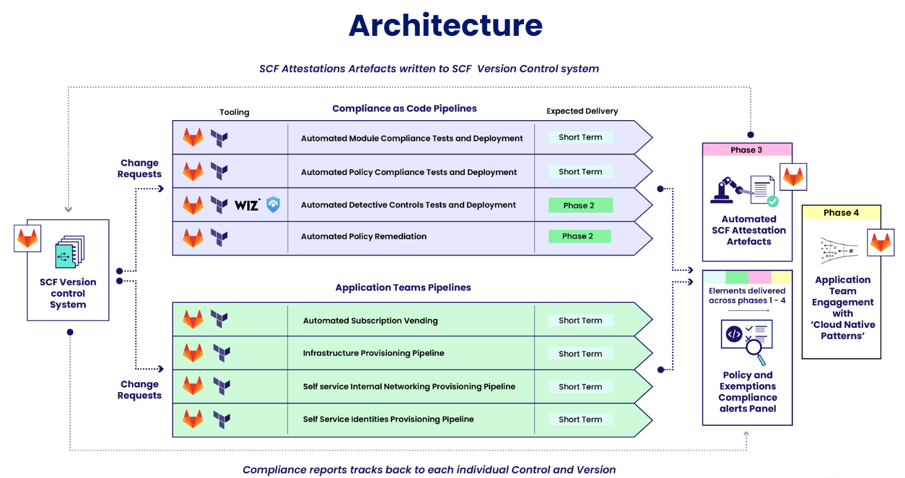
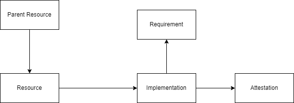
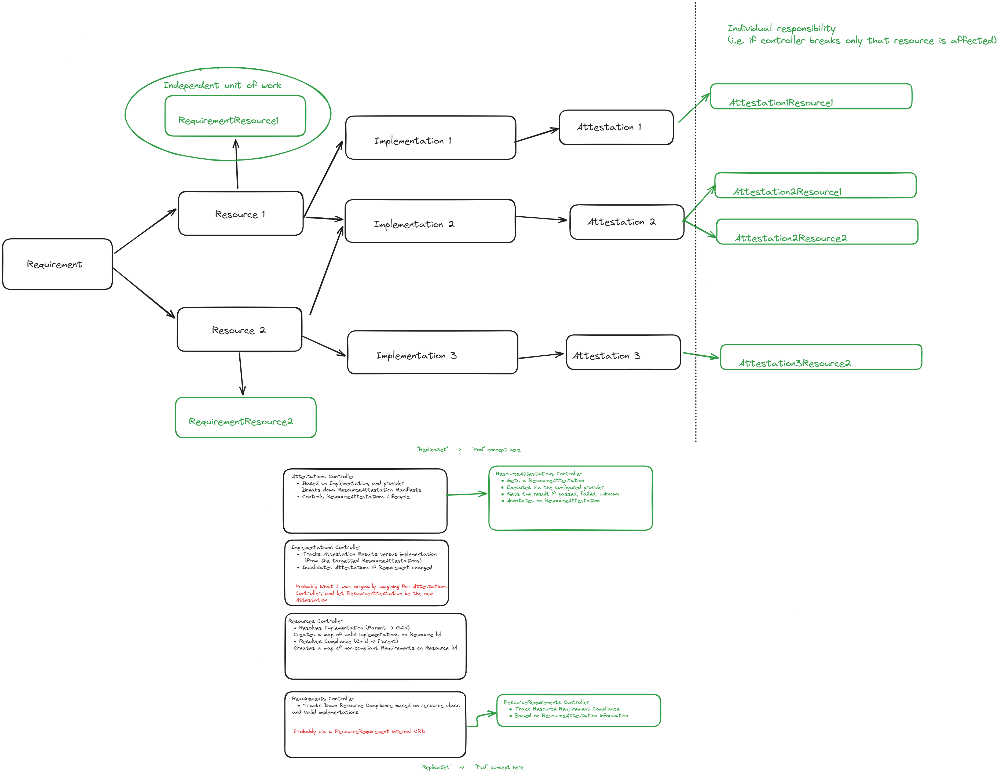
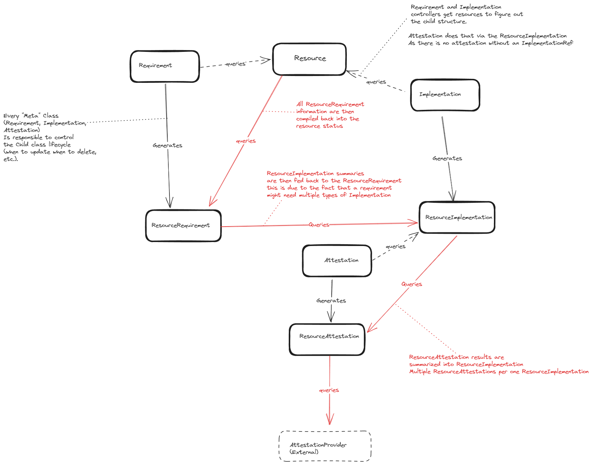

# Problem Definition

While many tools are actually available to implement compliance requirements, almost none of them actually focus on tracking the implementation themselves.

The goal of Argus is to oversee and continuously Attest Requirement Implementations across multiple Resources, and feed that information back with observability metrics. 

# Project Objective

To have something Attesting (reconciling) Implementations and Rerquirements continuously, generating metrics to be consumed with observability tools (i.e. be able to create a compliance SLO/SLI)

# Use Cases

## 1 The AWS Account
Use Case Details: [#7](https://github.com/ContainerSolutions/argus/issues/7)

## 2 The WebApp
Use Case Details: [#8](https://github.com/ContainerSolutions/argus/issues/8)

## 3 The Kubernetes
Use Case Details: [#6](https://github.com/ContainerSolutions/argus/issues/6)

# High Level overview

## General Architecture

## Objects overview

# Kubernetes Implementation
As part of the MVP for Compliance Framework, we will be creating a kubernetes operator. This is to leverage the following benefits that it provides OOTB:

 * Reconcile loops (so that we get asynchronous constant attestation)

 * Frontend (via prometheus metrics + grafana Dashboard)

In order to do that, the proposed architecture to follow is described in the picture below:

(PS this is a living diagram. It has been outdated 3 times while writing this document, please bear with the general idea)

It composes the following proposed Controllers:

* Resources Controller
    * Responsible for keeping track of resource compliance, including nesting resolution (Compliance on Child cascading to Parent)
    * Responsible for keeping track of valid implementations from ResourceImplementation Manifests

* Implementations Controller
    * Responsible for invalidating a given Attestation set if a Requirement ResourceVersion changes.
    * Responsible for keeping track of resource implementation, including nesting resolution (Implementation on Parent cascading to Child) 
    * Creates child "ResourceImplementation" manifests and manages their lifecycle

* ResourceImplementation Controller
    * Responsible for keeping track if a given set of ResourceAttestation results validate a given Implementation for a given resource

* Attestations Controller
    * Responsible for mapping out Resources needed to Attest.
    * Creates child "ResourceAttestation" manifests (aka pod to replicaset) and manages their lifecycle

* ResourceAttestations Controller
    * Based on a Resource, and on a provider, executes the provider call and gets the output
    * Tracks the output of the Attestation with logs, execution date, etc.

* Requirements Controller
    * Responsible for keeping track of Requirement Version.
    * Creates child "ResourceRequirement" manifests (aka pod to replicaset) and manages their lifecycle

* ResourceRequirements Controller
    * Keeps track of Resource compliance to individual Requirement based on The ResourceImplementations
    available for that Resource

## Information Flow diagram (i.e. how the Resource knows it is compliant?)

## Current Status

Right now the Kubernetes implementation only contains part of the CRDs defined for these 
controllers. Work is needed to help define the CRDs and each individual Controller implementation.